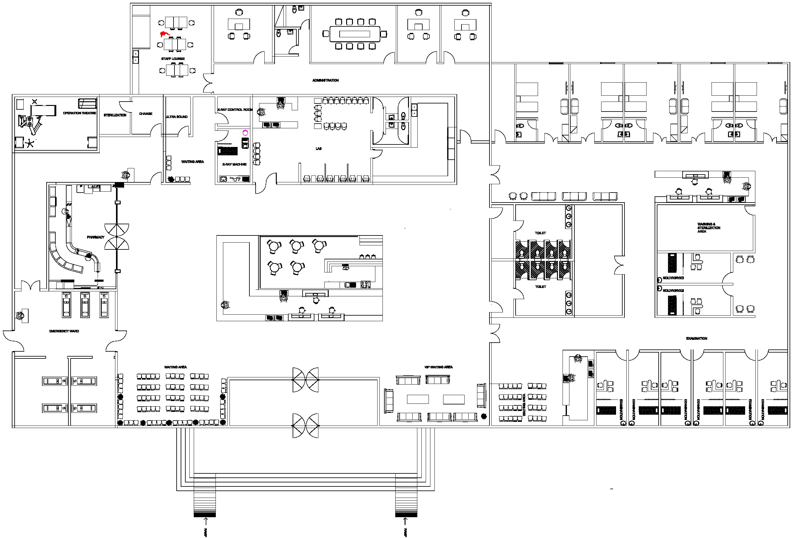
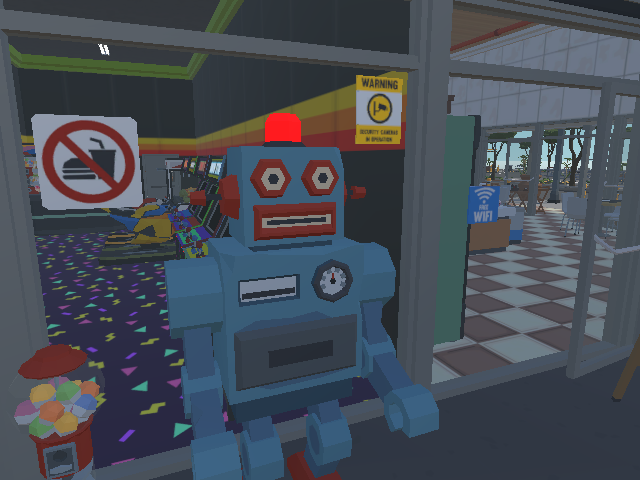
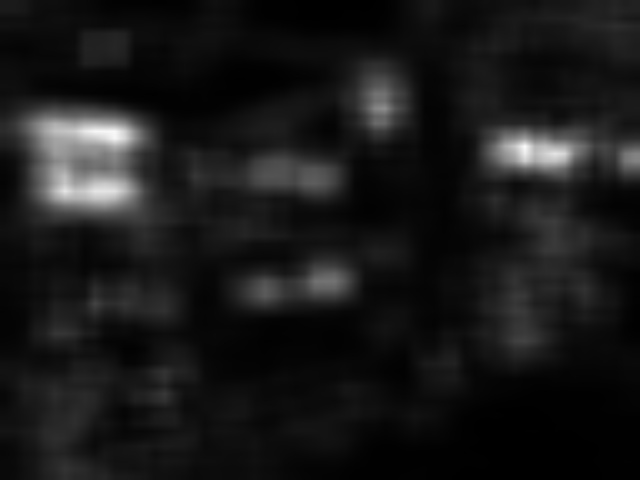
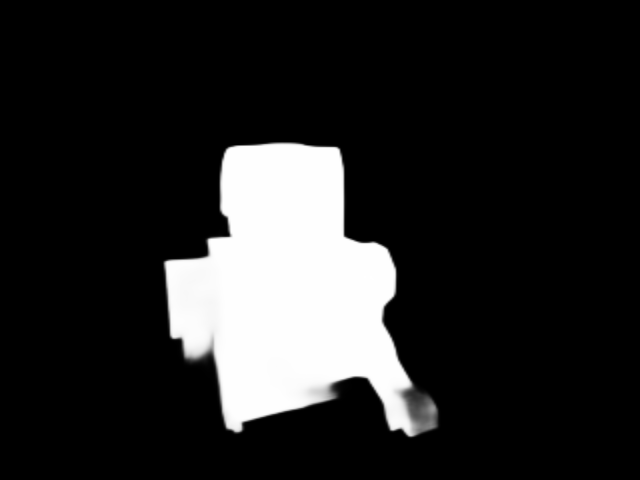
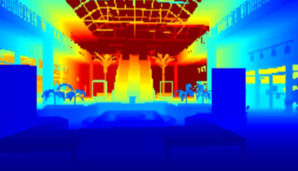

# This is a Work In Progress!

# Semantic Spatial Navigation

## Introduction:

We begin by introducing our work conceptually. This documentation follows the journey of implementing our ideas in simulation, then compares how they would be implemented in real life.

We aim to build an embodied AI agent that is capable of autonomous spatial navigation in a complex 3D Hospital environment. In it’s core this project draws inspiration from cognitive neuroscience, specifically how brains build and use spatial representations, to create an agent that is capable of mapping its surroundings, while also developing a semantic understanding of its surroundings and the space it traverses.

The agent integrates multiple components. From RGB-D cameras, CLIP for visual semantic embeddings, OCR for reading signs, and Large Language Models (LLMs) for interpreting natural langauge and linguistic commands. It’s essentially an intelligent Vision-Language-Action (VLA) model.

This work takes high inspiration from the paper and framework BSC-Nav by …….. .

The key novelty lies in what constitutes a landmark according to the agent’s logic. It utilizes visual saliency, structural importance, and semantic uniqueness to create said landmarks.

## The Environment:

To develop and evaluate our embodied AI agent, we built a realistic 3D hospital environment using Unity game engine. We ensured the design of the hospital to follow a certain philosophy of long, visually repetitive corridors that challenge place recognition, dense signage, cluttered scenes with medical equipment and other objects, along with semantic landmarks with varying saliency.

The floor plan of out hospital is as follows:



the agent spawn point for exploration phase is at the front doors. The reception first enters view, as the agent explores as per way points and active exploration.

The hospital is sectioned into four main zones: the emergency triage, examination and stay wards, reception and amenities, and administration.

To create a realistic hospital appearance, we used high resolution textures, PBR materials, and custom-modelled objects. Signage plays an important role, as it can be seen all around the hospital.

## Phase 1:  Visual Saliency

When humans walk through a hospital (or anywhere for that matter), certain things naturally catch their attention. Like a bright red exit sign, a large reception desk, or a vending machine in a plain corridor. This instinctive focus on noticeable things is called saliency. In our project, we gave the agent a similar ability to notice when a scene looks interesting or different from what it usually sees.

Saliency detection is the perception layer that tells the agent what in the scene is worth paying attention to so it can build a semantic map, create landmarks, and choose better exploration targets.

Think about walking down a long hospital hallway. Most of it looks the same. white walls, identical doors, similar lighting. Then you reach an intersection with a big sign or a waiting area with colorful chairs. Your brain pays attention to these spots because they're useful reference points. Later, when someone asks "where's the pharmacy?" you remember it was near that distinctive waiting area.

Our agent works the same way. Instead of treating every location equally, it pays more attention to visually interesting spots. These become candidates for landmarks .. places worth remembering.

Many saliency detection algorithms have recently been generated to simulate visual attention mechanisms. The human visual system has top-down (task-driven) and bottom-up (stimulus-driven) mechanisms [1].

Saliency detection methods are classified into two main categories: unsupervised and supervised approaches. The unsupervised methods are proposed according to the biological and psychological attributes of the human visual system. The supervised methods use machine learning technology to implement the saliency detection model [2]. Early models focus on unsupervised methods and aim to find objects with different visual features from their surrounding area. They use simple features like color, edge, and texture rather than complex ones like shapes and objects.

For saliency detection we tested two types with our prototype map:

In our initial approach, we experimented with OpenCV's built-in saliency detection modules. These classical methods typically operate on handcrafted features such as color histograms, local contrast, and frequency domain analysis [ref] While computationally efficient, they struggle significantly when faced with challenging scenarios common in hospital environments.

The fundamental limitation lies in how these methods define saliency. Most classical detectors assume that salient objects stand out from their surroundings like brighter colors, sharper edges, or unique textures. However, this assumption breaks down in several important cases:

Objects in cluttered backgrounds become nearly invisible to classical detectors because the surrounding visual noise masks the subtle cues that might indicate a salient region. Camouflaged objects present an even greater challenge. In medical environments, equipment may blend with walls, signage may match surrounding colors, or important landmarks may be intentionally non-disruptive.

The results of OpenCV’s saliency on our prototype map were as follows:





To address these limitations, we turned to BASNet (Boundary-Aware Segmentation Network) [ref] , a deep learning architecture specifically designed for highly accurate salient object detection with particular attention to boundary quality . BASNet was developed by Qin et al. and is a supervised, stimulus-driven model. it has shown exceptional performance on challenging datasets including those containing camouflaged objects and cluttered scenes .

BASNet actually figures out where the object starts and ends, giving you clean, precise edges. That matters when you're trying to anchor a landmark to an exact location, not just a fuzzy area. It's also surprisingly fast. It runs at over 70 frames per second on a decent GPU.

We created a wrapper for BASNet. The pseudocode for the BASNet wrapper is as follows:

```python
1: CLASS BASNetSaliency:
2:     set computing device (GPU or CPU)
3:     load pre-trained weights from model_path
						# according to how the model has been trained
4:          if weights have 'module.' prefix, strip that
5:     set model to evaluation mode
6:     define preprocessing:
7:          resize image to 320*320
8:          normalize pixel values according to ImageNet constants (mu, sigma)

9:     FUNCTION get_saliency_map(Input: image)
10:         apply preprocessing
11:         pass the image through the NN
12:         extract the output map (raw logits)
13:         normalize the map per min-max
14:         resize map back to original using Bilinear interpolation
15:         return normalized 2D array
```

and the resulting saliency map was:



which was a huge improvement.

## Phase 2: Depth Reconstruction

Now that we can tell objects of interest that could be landmarked and stored in the memory graph, how do we know its global world position from a picture? The answer lies in depth maps.

Depth refers to how far objects are from the camera. A depth map computes this for an entire scene, producing a heatmap of object distances. This process is also known as depth perception.

There are two major types of depth estimation: monocular depth and active depth sensing. The former predicts depth from a single RGB image using learning-based methods like neural networks. The latter uses dedicated hardware such as stereo cameras, or LiDAR to measure distance.

Monocular depth estimation takes a single RGB image and predicts a depth map where each pixel’s value represents the distance from the camera to the corresponding point. However, the issue with monocular methods is that the output is often relative depth. They estimate the order of distances (like pixel A is closer than pixel B) but not absolute metric scale. It suffers from scale ambiguity and produces depth maps that are consistent to an unknown global scale factor. To obtain metric distances, you need additional calibration or known object sizes.

We tested with monocular depth before deciding to transition to active depth sensing. Here we introduce RGB-D cameras.

RGB cameras are regular cameras which delivers colored images by capturing light in red, green, and blue wavelengths. An RGB-D camera combines conventional 2D images with depth information. It assigns a depth value to each pixel, allowing for a representation of how far each pixel is from the camera in a manner similar to that in monocular depth estimation. But the difference is that in monocular, depth is *estimated* while in RGB-D it’s *measured.*

We implemented an RGB-D camera in unity as per blogpost in [ref]. Unity’s rendering pipeline maintains a depth buffer for every frame. As per official Unity documentation, we know that the values in the buffer are non-linear. Meaning they are mapped via the inverse of the projection matrix. To obtain usable metric distances, we need to convert these values tolinear eye-space depth.

That can be accomplished using a custom shader and some other operations that we will not get too much into detail as not to go off topic. The depth data is stored in CPU.

We set up a TCP connection over port 5004. We convert the depth array into a byte array using `Buffer.BlockCopy` (it’s a 32-bit float representation). This byte array is then encoded as a Base64 string in a JSON message alongside the RGB image, camera intrinsic parameters (FOV), and camera world position. The message is sent over our TCP port. Why do we encode it as a base64? the way unity processes images might differ from that of python, and sending a raw image (1s and 0s) using JSON (which is a text-based format) might cause the binary data to break or be misinterpreted.

On the python side, we receive the JSON message, parse it, extract the depth string, then decode the base64 to which we obtain a bytes object and convert it to a numpy array. We convert this array to 2D.

We need to reconstruct the 3D positions from our 2D image and depth information. To do so we utilized the Pinhole Camera Model. This model describes the relationships between the coordinates of a 3D point in world space and its projection onto a 2D image plane.

In this model, light rays from the environment pass through a single point (the camera center) before hitting the image sensor. Provided intrinsic parameters like focal length and principal point (the center of the image) are given, w can transform pixels to meters as a linear scaling problem.

**Intrinsic parameter derivation:** to translate a 2D pixel coordinate (c_x, c_y) into a 3D vector, we first define the camera’s intrinsic matrix. We derive the virtual focal length f from the vertical field of view (fov) and the image height *h* provided by Unity:

		$f = \frac{h}{2 \cdot \tan\left(\frac{FOV}{2}\right)}$

**inverse projection and world transformation:** using the sampled distance Z from the depth map, we perform inverse projection to find the point’s position relative to the camera. (given a pixel (u,v)):

$X = \frac{(u - c_{img}) \cdot Z}{f}, \quad Y = \frac{(v - c_{img}) \cdot Z}{f}$

Because the simulation environment (Unity) utilizes a **Left-Handed** coordinate system (+Z forward) while standard computer vision libraries utilize a Right-Handed system (+Z backward), a coordinate system transformation is required. We apply a sign-flip to the Z and Z components to ensure compatibility with standard rotation mathematics:

$P_{RH} = \begin{bmatrix} X \\ -Y \\ -Z \end{bmatrix}$

the pseudocode for the unity side is as follows:

```python
1: CLASS SensorMessage
2:    DATA rgb_string, depth_string
3:    DATA width, height, fov, timestamp
4:    DATA position (x,y,z), rotation (x,y,z,w)

5: CLASS SensorSend:
6:    FUNCTION Start():
7:       prepare graphics buffers for rgb and depth
8:       CALL ConnectToServer()

9:    FUNCTION ConnectToServer():
10:      start TCP socket to 127.0.0.1 on port 5004]
11:      start SendLoop()

12:   FUNCTION SendLoop():
13:      while connected:
14:          wait for send interval
15:          wait for end of frame (to ensure rendering is done)
						 # process depth
16:          convert raw gpu depth to linear meters
17:          read pixels into float array
18:          convert float array to byte array (base64 string)
						 # process rgb
19:          read screen pixels
20:          compress pixels to jpeg byte array (base64 string)

21:          get camera transform and fov
22:          create msg= new SensorMessage(all captured data)
23:          convert msg to JSON string
24:          send JSON string + newline to server
```

the pseudocode for the python side is as follows (for parsing and visualization code, refer to section/phase 4):

```python
1: FUNCTION DecodeDepth(input: base64string, width, height):
2:     convert base64 text back to raw binary bytes
3:     interpret bytes as a list of 32-bit floats (for precision)
4:     reorganize flat list into a 2D array of [height, width]
5:     return depth_grid

6: # since the depth map is lower resolution than rgb images this function finds the matching spot
7: FUNCTION SampleDepthAtPixel():
8:     scale the screen coordinates (x,y) to match the depth map resolution
9:     clamp coordinates
10:    define a small square around the coordinate
11:    calculate median of those values (filter out noise)
12:    return median

13: FUNCTION DepthToWorldPoint(input: pixel_x, pixel_y, distance, fov, cam_pos, cam_rot):
		# 1. calculate camera intrinsics
14:    convert field of view to radians
15:    calculate focal length based on screen height and fov
16:    find image center

		# project to 3d
17:    set z= distance
18:    calculate x = (pixel_x - center__x)*z/focal_length
19:    calculate y = (pixel_y - center_y)*z/focal_length
20:    store as 3d point [x,y,z] relative to camera

		# swap coordiante system
21:    flip y and z signs to convert from unity to math
22:    adjust camera position and rotation to match right-handed math

		# final global position
23:    apply camera rotation to 3d point
24:    add camera world position to result
25:    flip back to unity coordinates 
26:    return back to final world coordinates
```

Now that our RGB-D camera is ready and the pipeline is working well, we can capture depth images that look like these:



the blue means close and the red means far.

As for projecting into 3D coordinates, we managed to get the correct position for objects in unity from its relevant depth map and rgb image using our depth to world function.

We suffered with a +-2 meter off from actual positions at the beginning, which we managed to fix by increasing the depth map resolution. Before, we had a 64*64 map, which the slightest shift would cause devastating error margins. We also had to ensure we were using the right equations and conversions from and to right handed and left handed coordinates. Fixing near and far lengths of the camera also helped.

## Phase 3: CLIP and OCR

While visual saliency tells the agent where to look and depth tells where in the world an object is, we still need to understand what that object is. For this, we turn to two complementary sources of semantic information: CLIP for visual‑semantic classification and OCR (Optical Character Recognition) for reading text from signs.

CLIP is a multi-modal vision-language model developed by OpenAI that learns visual concepts from natural language supervision . Unlike traditional computer vision models trained on fixed, predefined object categories, CLIP is trained to understand images in conjunction with the text that describes them.

CLIP consists of two primary components: an image encoder (a vision transformer or ResNet architecture), and a text encoder that’s transformer-based and maps the text descriptions to the vector representation.

CLIP is trained on 400 million image-text pairs. This enables what is called “zero-shot classification”. It means that given an image and a set of descriptors, CLIP can predict which description best matches the image without needing any fine-tuning.

In our initial experiments, we used the standard pre-trained CLIP with model ViT-B/32 directly on our target classes, we noticed quickly that domain-specific (hospital specific) were not reliably recognized. These concepts are underrepresented in the image datasets CLIP was trained on. 

To address this, we fine-tuned CLIP on a custom dataset of 300-400 images collected directly from our Unity hospital environment and labeled them manually with our predefined target classes. The fine-tuning process used the same contrastive loss as the original but on our small dataset. We updated only the final projection layers and ran training for XXXX number of epochs to avoid overfitting.

The result was a model that achieved significantly higher classification accuracy on our environment, while still retaining the general‑purpose knowledge of the original CLIP (thanks to the moderate fine‑tuning). This fine‑tuned model now serves as the core semantic engine for our agent.

The clip pipeline is fed the RGB images as the agent explores and are classified which returns a probability distribution over target classes. The class with the highest probability becomes the landmark’s label. we extract embeddings through the vision encoder’s output (a 512-d feature vector).

The fine-tuned model is saved and loaded once at startup and reused for every frame.

example of a frame that was fed to CLIP and the text pair:

[](https://www.notion.so)

As for OCR, many landmarks in a hospital have textual information: signs indicating departments, room numbers, emergency exits, or directions. To capture this, we integrate an OCR engine (Tesseract) into the pipeline.

For the whole RGB image, we run OCR that returns any detected text and its bounding boxes. Because our main object of interest is already highlighted by saliency, we can optionally restrict OCR to the area around the detected object.

The OCR output is stored as a string. When multiple observations of the same landmark occur, we keep the longest or most descriptive text (a simple heuristic that works well in practice).

## Phase 4: Spatial Mapping and Landmark Persistence

With the ability to see (Saliency), locate (Depth), and identify (CLIP/OCR) objects, the agent requires a centralized "memory" to store this information. Without a persistent map, the agent would treat every frame as a brand-new world, leading to a redundant and cluttered understanding of its environment.

We implemented a semantic mapping system that transforms transient visual detections into a persistent, graph-based representation of the hospital. We utilize a topological-semantic graph, which is basically a way to combine connectivity (topology) and meaning (semantics). In this graph:

**Nodes** represent unique landmarks (e.g., "Couch lm_12" or "Exit Sign lm_5"). Each node stores its global coordinates, a fused CLIP embedding, and any detected OCR text.

**Edges** represent temporal or spatial relationships, allowing the agent to understand how different landmarks are connected as it traverses corridors.

**The duplicate avoidance and identity:** A primary challenge we came across was the "aliasing" problem (detecting the same landmark multiple times and mistakenly creating duplicate entries). To solve this, we developed a multi-stage filtering mechanism:

1. **Spatial Gating:** When a new object is detected, we use a KD-Tree. A KD-Tree is a binary tree data structure used to organize points in k-dimensional space. A KD-Tree offers multiple operations, including construction, nearest neighbor serach, and range search. It enables fast spatial searching to find existing landmarks within a 1.0-meter radius.
2. **Semantic Verification:** If a nearby landmark is found, we compare its stored CLIP embedding with the new detection using Cosine Similarity. If the similarity exceeds a threshold (0.85) the agent concludes they are the same object.
3. **Identity Consistency:** We implemented a label voting system. If the agent previously labeled an object as a "chair" but a single noisy frame suggests "couch" the landmark retains the "chair" label unless the evidence shifts consistently over time.

**Data fusion and Kalman filtering:**

When the agent confirms a match, it doesn't just discard the new data. Instead, it fuses it to improve the map's accuracy. we use a weighted position update: We utilize a logic similar to a Kalman Filter, which is a recursive algorithm that estimates the state of a dynamic system from a series of incomplete and noisy measurements. Detections made from a distance are noisy, while up-close detections are precise. We weight the landmark’s new position more heavily when the agent is closer to the object.

We use an Exponential Moving Average (EMA) to refine the CLIP embedding, ensuring the visual signature of the landmark becomes more robust with every observation.

lastly, we visualize the stored landmarks as Unity Gizmos where round objects signify nodes and lines connecting them signify edges.
